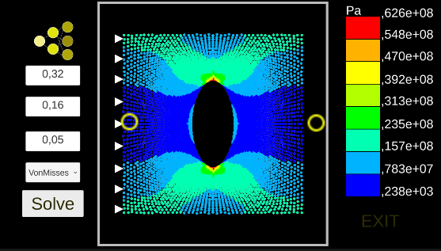

# Finite-Nodal-Neural-Analysis
Mobile Finite Nodal Neural Analysis is a virtual laboratory that allows the user to interact with the stress fields over a plate with a hole by applying the boundary conditions using the screen touch in a mobile platform. Artificial Neural Networks were trained to predict the Von Misses and Tresca stress fields and the coordinates of the nodes that discretize the continuous medium to achieve such a goal.

